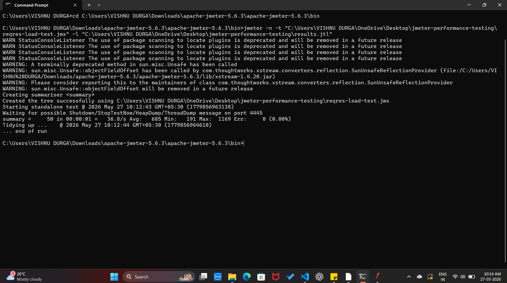

<h1 align="center">⚡ JMeter Performance Testing</h1>

  Performance and load testing using Apache JMeter on reqres.in REST API
  simulating 50 concurrent virtual users

---

## 🛠️ Tools Used

---

## 📌 What This Project Covers

- ✅ Load testing with 50 concurrent virtual users
- ✅ API performance measurement — response time, throughput
- ✅ Error rate validation
- ✅ Real-world API testing on reqres.in
- ✅ Command line test execution

---

## ⚙️ Test Configuration

| Parameter | Value |
|---|---|
| Tool | Apache JMeter 5.6.3 |
| Target API | https://reqres.in/api/users |
| Method | GET |
| Virtual Users | 50 |
| Ramp-up Period | 10 seconds |
| Loop Count | 1 |

---

## 📊 Test Results

| Metric | Value |
|---|---|
| Total Requests | 50 |
| Average Response Time | 685 ms |
| Min Response Time | 191 ms |
| Max Response Time | 1169 ms |
| Throughput | 36.8 requests/sec |
| Error Rate | 0.00% |

---

## 📸 Test Execution Screenshot

---

## ▶️ How to Run

### Prerequisites
- Java JDK 21+
- Apache JMeter 5.6.3

### Run from command line
